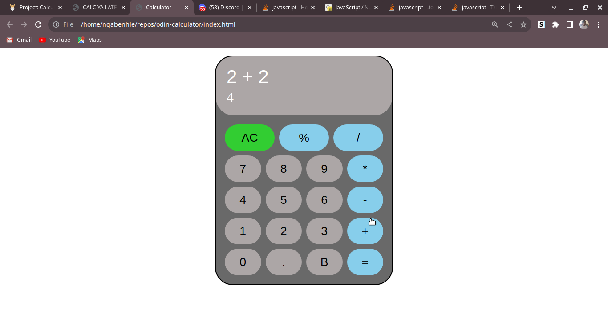

# Calculator

This is a simple calculator that handles simple arithmetic operations, like adding, subtraction, multiplication, and division.

## Live Preview


## How it works

When a user clicks on a button a click event listener invokes ```controller()``` with the input (or clicked button's value) as an argument.

### Controller

Controller receives an input as an argument and invokes ```validateOperations()``` to validate the operation before continuing. 

Just a quick explanation on how ```validateOperations()``` works, it receives an input and takes a look at ```displayValue``` to figure out if the user's input make the operation valid or not. We'll go more into details later on.

Controller simply takes an input and tries to figure out the best action to take depending on the input. It uses a ```switch``` statement to allocate a case to a certain action, here's an example:

```javascript
switch (input) {
    case "AC":
      clearScreen();
      break;

    case "undo":
      undo();
      populateDisplay();
      break;

    case "=":
      getFinalAnswer();
      break;

    case "%":
      getPercentage();
      populateDisplay();
      break;

    case "1":
    case "2":
    case "3":
    case "4":
    case "5":
    case "6":
    case "7":
    case "8":
    case "9":
    case "0":
      appendDigit(input);
      populateDisplay();
      break;
  }
```

### Populate Display

This is the most used function in the app, it is used to update the screen/display when anything changes. 

```populateDisplay()``` reads every value in ```displayValue``` and for each value it checks if it's an operator or a number. If it's a number then ```formatDigits()``` is used to format the number (using ```toLocaleString()```) before displaying it.

On the bottom of the calculator's screen we also display the current answer before the user clicks the equal sign (=). ```getCurrentAnswer()``` is used to get the answer of what the operation equates to, we'll take a look at this function later.

### displayValue / Logic

Let's take a look at the idea/logic behing how this calculator works. ```displayValue``` is used for almost every thing, it's not just what is displayed on the screen but it used by ```validateOperations()``` and ```getCurrentAnswer()``` for validation user's input and calculating the current/final answer. 

The idea is that the user is not allowed to start the operation with an operator but has to start with number (or negative number). If the first value is a number that means the second one has to be an operator and the third one has to be a number.

Let's take a look at this example that will try to clear explain this idea.

```javascript

// Let's say the users clicks this sequence of buttons 3 + 22 =

// Initially displayValue is an empty array

let displayValue = [];

// User clicks '3'

// Since is a number it will be allowed to be the first value of displayValue/operation

displayValue = ['3']; // Updated

// Now the user clicks '+'

// This value will be pushed to display value

displayValue.push(' + '); // displayValue = ['3', ' + '];

// NOTE: Above we used trailing spaces before and after the operator for display purpose,
// This is trimmed out later on

// The user clicks '2'

// Before adding a value to displayValue we check the length of displayValue, 

// If the length is odd and the input is an operator then validaOperations returns false
// This is mainly because by logic the numbers are expected to be at an odd indexes and operators at an even indexes.

// In this case the length is even so we push to the array

displayValue.push('2');

displayValue = ['3', ' + ', '2']; // The list now looks like this

// The user will now click '2' again

// The length of displayValue at this point is 3 which is odd, 
// we know very well that the rules/logic doesn't allow us to push '2' to the list 
// because the next available index is 3 (odd) and only operators are only allowed at odd indexes.

// So instead we'll do something like this

const arrayLength = displayValue.length;
displayValue[arrayLength - 1] = displayValue[arrLength - 1] + '2';

// We just append '2' to the last element in the list instead of adding a new index

// Finally, the user clicks =

// getCurrentUser() will calculate the answer and displayValue will be updated to 25 (3 + 22)

displayValue = ['25']; // updated with the answer
```

I hope that explains it, but just to recap, we must remember that numbers can only be in even indexes and operators only in odd indexes.

But, what happens if a user clickes the buttons in this sequence: ```3 + *```. 3 is valid, the plus sign is also valid but the multiplication (\*) cannot be used here (index is even). So, the addition sign (+) will just be replaced by the multiplication sign (\*).

Let's take a look at this sequence ```3 * -```, will this be allowed? It turns out that the answer is yes. I know you are probably asking *why, didn't we say that an operator cannot be at an even index (2)?* Well, the minus sign (-) is the exception as it can be used to indicate that the number is negative. After all, this sequence/operations is valid, ```3 * -5```. If the user clicks the equal to button before adding the five he will get a message saying NaN (not a number).

### Get current answer

```javascript

const getCurrentAnswer = (array, previousAnswer = 0) => {
  if (array.length % 2 === 0 || array.length <= 1) {
    return previousAnswer;
  }

  const newArrayCopy = array.slice(3);

  // trim operator (array[1]) because by default it has trailing
  // space for display purposes
  const answer = operate(+array[0], +array[2], array[1].trim());
  newArrayCopy.unshift(answer);
  return getCurrentAnswer(newArrayCopy, answer);
};

const operate = (numA, numB, operator) => {
  switch (operator) {
    case "+":
      return add(numA, numB);

    case "-":
      return subtract(numA, numB);

    case "*":
      return multiply(numA, numB);

    case "/":
      return divide(numA, numB);
  }
};

```

```getCurrentAnswer()``` is a recursive function that creates a new array and copies the original array to the new array but excluding the first 3 elements. It then invokes `operate()` to calculate the value of the of the first two numbers using the operator at index 1. The answer is then added at the beginning of the array. The process continues until the array has only one element.

Let's look at this example:

```javascript

// getCurrentAnswer() is invoked

let array = ['1', '+', '2', '+', '3', '+', '4'];

let copy = ['+', '3', '+', '4']; // excluding the first 3 elements

// Operate is then invoked on the first 3 elements
const answer = operate(1, 2, '+'); // answer = 3

copy = ['3', '+', '3', '+', '4']; // answer is added

// getCurrentAnswer() is invoked again

getCurrentAnswer(['3', '+', '3', '+', '4'])

// the same process happens again

let copy = ['+', '4']; // excluding the first 3 elements

// Operate is then invoked on the first 3 elements
const answer = operate(3, 3, '+'); // answer = 6

copy = ['6', '+', '4']; // answer is added

// getCurrentAnswer() is invoked again

getCurrentAnswer(['6', '+', '4'])

// the same process repeats

let copy = []; // excluding the first 3 elements

// Operate is then invoked on the first 3 elements
const answer = operate(6, 4, '+'); // answer = 10

copy = ['10']; // answer is added

// at this point the array's length is 1 and the answer which is 10 will be returned

```

### The cool / extra feature

The feature that I am most proud of was the one which was not part of the project's requirements, 

I decrease/increase the ```fontSize``` of the ```inputDisplay``` depending on the number of characters on the screen. This is to make it easier for the user to see the operation without having to scroll. Here's the code for it:

```javascript

// Change font-size of inputDisplay depending on 
// the number of characters displayed
buttons.forEach((button) => {
  button.addEventListener('click', () => {
    const inputDisplay = document.querySelector('.input');
    const displayLength = displayValue.join('').length;
    if (displayLength >= 24) {
      inputDisplay.style.fontSize = '8px';
    } else if (displayLength >= 18) {
      inputDisplay.style.fontSize = '12px';
    } else if (displayLength >= 12) {
      inputDisplay.style.fontSize = '16px';
    } else {
      inputDisplay.style.fontSize = '21px';
    }
  });
});

```

## Credits
The project is part of [The Odin Project's](https://www.theodinproject.com/lessons/foundations-calculator) [curriculum](https://www.theodinproject.com/).

## Conclusion

I had a fun time while I was making this project, feel free to fork it and modify it as you see fit. 